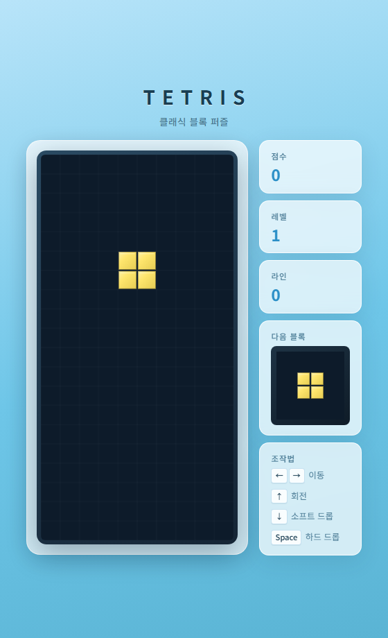

# 테트리스 (Tetris)

순수 HTML / CSS / JavaScript로 만든 클래식 테트리스 게임입니다.  
빌드 도구나 프레임워크 없이 브라우저에서 바로 실행할 수 있습니다.



## 실행 방법

1. 이 저장소를 클론하거나 ZIP으로 받습니다.
2. `index.html` 파일을 **더블클릭**하거나 브라우저로 드래그합니다.
3. 별도 설치나 서버 실행 없이 바로 플레이할 수 있습니다.

```bash
# 또는 로컬 서버로 열기 (선택)
npx serve .
```

## 조작법

| 키 | 동작 |
|---|---|
| `←` `→` | 블록 좌우 이동 |
| `↑` | 시계 방향 회전 |
| `↓` | 소프트 드롭 (한 칸씩 빠르게 낙하) |
| `Space` | 하드 드롭 (즉시 바닥까지 떨어뜨림) |

## 게임 규칙

- **7가지 테트로미노** (I, O, T, S, Z, J, L)가 무작위로 등장합니다.
- 블록은 일정 간격으로 자동 낙하하며, 바닥이나 다른 블록에 닿으면 고정됩니다.
- 가로 한 줄이 가득 차면 해당 줄이 삭제되고, 위 블록이 아래로 내려옵니다.

### 점수

| 지운 줄 수 | 점수 |
|-----------|------|
| 1줄 | 100 |
| 2줄 | 300 |
| 3줄 | 500 |
| 4줄 | 800 |

### 레벨

- **500점**마다 레벨이 1 오릅니다.
- 레벨이 올라갈수록 블록 낙하 속도가 빨라집니다.

## 게임 오버 & 다시 시작

- 새 블록이 등장할 공간이 없으면 **게임 오버**가 표시됩니다.
- **다시 시작** 버튼을 누르면 보드와 점수가 초기화되고 게임이 새로 시작됩니다.

## 파일 구성

| 파일 | 설명 |
|------|------|
| `index.html` | 게임 화면 구조 (캔버스, 점수 패널) |
| `style.css` | 레이아웃 및 UI 스타일 |
| `script.js` | 게임 로직, 충돌 판정, 렌더링 |
| `screenshot.png` | 게임 화면 캡처 |

## 기술 스택

- HTML5 Canvas
- CSS (반응형 레이아웃)
- Vanilla JavaScript (ES6+)
